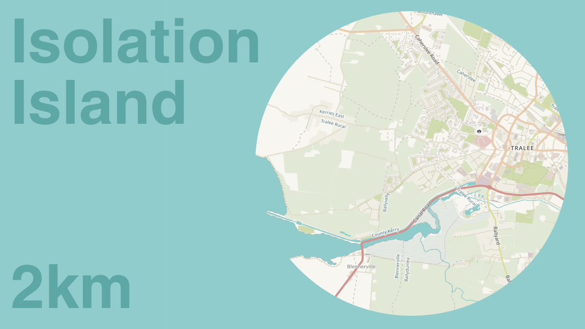

# Isolation Island

Due to the COVID-19 pandemic the Irish government has introduced restrictions on unnecessary travel which means that people can only exercise within 2 (later 5) kilometers of their homes.

I thought it might be a good idea to take this opportunity to get to know the area around my home a bit better so I put together a map which show only your 2km limits, I designed the map to look like the rest of the world is just sea so hence Isolation Island and with the help of some Open Data it might help you to discover some interesting historic locations within your limits.

The map uses the following data sources:
* National Inventory of Architectural Heritage (NIAH) National Dataset
* National Monuments Service – Archaeological Survey of Ireland
* National Monuments Service – Wreck Viewer

[more info](http://www.vool.ie/isolation-island/)

You can generate your own COVID-19 Isolation Island map here:
[isolationisland.vool.ie](https://isolationisland.vool.ie)
